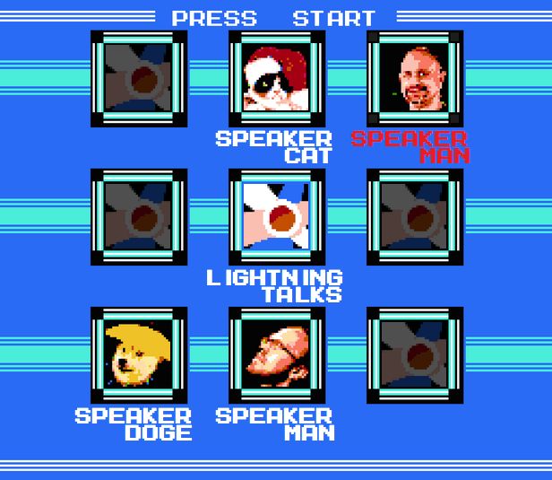

# Lightning Select

Randomizer for choosing lightning talk speakers

## Usage

You should clone lightning-select, add your own avatar images in `img/`, and modify `index.html` to use the images and speaker names of your choosing.  Speakers should only go in the 8 outer frames, not in the center frame.

Then open `index.html` in your web browser.

**Click the center frame** to choose a random speaker.  The selector will move around for a moment to create suspense, and then will highlight a name in red when it stops.  The selector will never stop on a "dimmed" frame.

**Click a speaker frame** (one of the 8 outside frames) to dim/undim the speaker.  When dimmed, speakers will not be chosen by the random selector.

*Don't forget to play [cool tunes](https://soundcloud.com/groups/chiptunes) while Lightning Select is visible!*

<iframe width="100%" height="300" scrolling="no" frameborder="no" src="https://w.soundcloud.com/player/?url=https%3A//api.soundcloud.com/groups/1662&amp;color=0066cc&amp;auto_play=false&amp;hide_related=false&amp;show_artwork=true"></iframe>

## How to create avatar images

1.  Find an image of the person
1.  Crop the image to a square such that most of the remaining area is covered by the person's face
1.  Increase the contrast and brightness of the image such that the highlights on the skin get washed out and the shadows are not too large
1.  Scale the image to 30x30 pixels
1.  Convert the image to the color palette of [img/background.png](img/background.png) (In The GIMP, simply open background.png and paste the avatar image in to it.)
1.  Resize the image to 120x120 pixels with no interpolation

