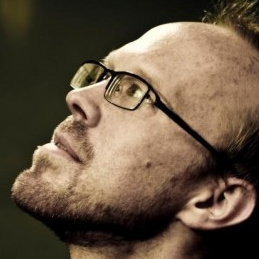
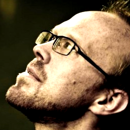

## How to create avatar images

1.  Find an image of the person
1.  Crop the image to a square such that most of the remaining area is covered by the person's face
1.  Increase the contrast and brightness of the image such that the highlights on the skin get washed out and the shadows are not too large
1.  Scale the image to 30x30 pixels
1.  Convert the image to the color palette of [img/background.png](img/background.png) (In The GIMP, simply open background.png and paste the avatar image in to it.)
1.  Resize the image to 120x120 pixels with no interpolation

